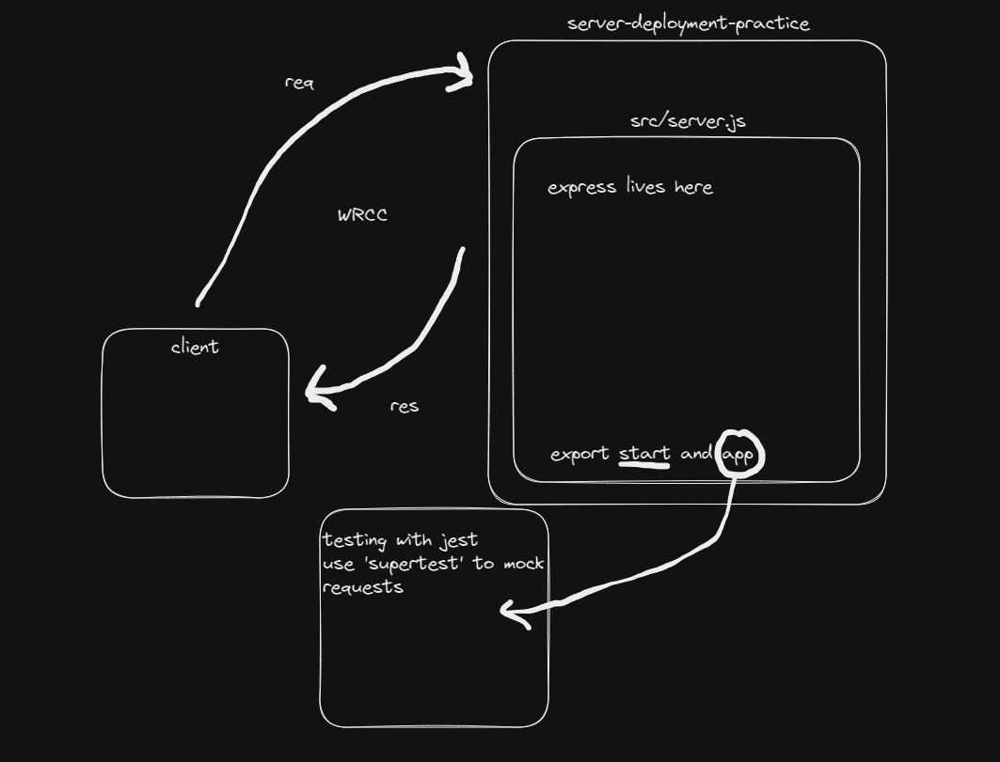

# LAB - Class 01

## Project: server-deployment-practice

### Author: Ryan Eastman

### Problem Domain

This is a basic server created to practice deploying a Node.js server used as a base for CI/CD deployment exercises.

### Links and Resources

- [GitHub Actions ci/cd](https://github.com/rkgallaway/server-deployment-practice-d51/actions)
- [back-end server url](http://xyz.com) (when applicable)
- [front-end application](http://xyz.com) (when applicable)

### Collaborators

- Ryan Gallaway

### Setup

#### `.env` requirements (where applicable)

- `PORT` - 3001
- port variables exist within the .env file, which is not included in the .gitignore file. This is because the .env file is not pushed to GitHub, and is only used locally. The .env file is used to store sensitive information, such as API keys, and is not to be shared with other users.
- I have a .env.sample file as well, which is a template for the .env file another user would need to create to run this app locally.

#### How to initialize/run your application (where applicable)

- clone repo
- `npm i`
- run `nodemon` or `node index.js` in the terminal to start the server

#### How to use your library (where applicable)

#### Features / Routes

- Feature One: Details of feature
- GET : `/` - specific route to hit proof of life
- GET : `/success` - successful route
- GET : `/bad` - unsuccessful route
- USE : `/*` - catch-all route

#### Tests

- How do you run tests?
  - To run tests, run `npm test`
  - 4 tests will be ran, all 4 should be passing
- Any tests of note?
  - handles the root path
  - handles success route
  - handles error route
  - handles bad route
- Describe any tests that you did not complete, skipped, etc.
  - I did not skip any tests. I have a test for each handler in my server.

#### UML

